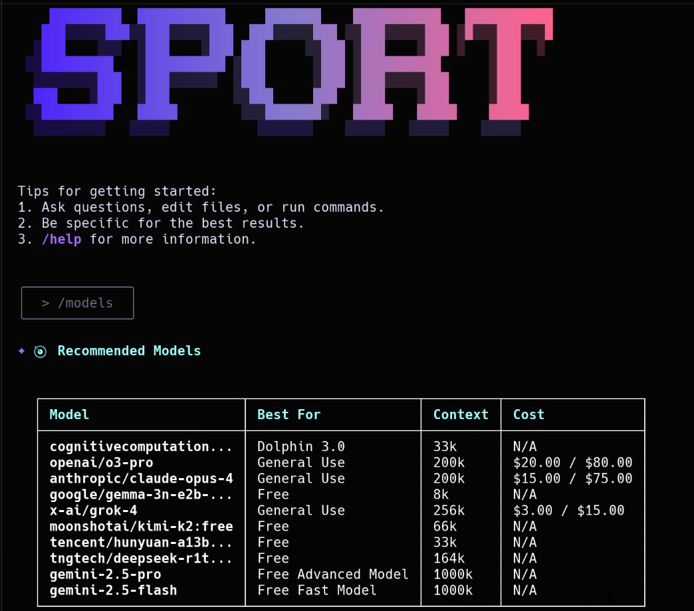

# sport-cli - Multi-Provider AI CLI

[](https://github.com/sportsculture/gemini-cli/actions/workflows/ci.yml)



> **Origin:** sport-cli is a fork of [Google's gemini-cli](https://github.com/google-gemini/gemini-cli), extended with multi-provider AI support and enhanced features. We maintain an upstream remote to incorporate Google's ongoing improvements while adding our own innovations.

This repository contains sport-cli, a multi-provider command-line AI workflow tool that connects to your
tools, understands your code and accelerates your workflows with support for various AI providers.

With sport-cli you can:

- Query and edit large codebases using multiple AI providers (Gemini, OpenRouter, DeepSeek, and more)
- Generate new apps from PDFs or sketches, using multimodal AI capabilities
- Automate operational tasks, like querying pull requests or handling complex rebases
- Use tools and MCP servers to connect new capabilities, including [media generation with Imagen,
  Veo or Lyria](https://github.com/GoogleCloudPlatform/vertex-ai-creative-studio/tree/main/experiments/mcp-genmedia)
- Ground your queries with the [Google Search](https://ai.google.dev/gemini-api/docs/grounding)
  tool when using Gemini
- Switch between AI providers seamlessly with the `/model` command
- Track token usage and costs across different providers

## Quickstart

1. **Prerequisites:** Ensure you have [Node.js version 20](https://nodejs.org/en/download) or higher installed.
2. **Run the CLI:** Execute the following command in your terminal:

   ```bash
   npx https://github.com/sportsculture/gemini-cli
   ```

   Or install it globally:

   ```bash
   npm install -g @sport/sport-cli
   ```

   **Alternative: Install from source** (recommended if you have an existing gemini installation):

   ```bash
   git clone https://github.com/sportsculture/sport-cli
   cd sport-cli
   npm install
   npm run build
   npm install -g .
   ```

   Then, run the CLI from anywhere:

   ```bash
   sport
   ```

3. **Pick a color theme**
4. **Authenticate:** When prompted, sign in with your personal Google account. This will grant you up to 60 model requests per minute and 1,000 model requests per day using Gemini.

You are now ready to use the Gemini CLI!

### Use a Gemini API key:

The Gemini API provides a free tier with [100 requests per day](https://ai.google.dev/gemini-api/docs/rate-limits#free-tier) using Gemini 2.5 Pro, control over which model you use, and access to higher rate limits (with a paid plan):

1. Generate a key from [Google AI Studio](https://aistudio.google.com/apikey).
2. Set it as an environment variable in your terminal. Replace `YOUR_API_KEY` with your generated key.

   ```bash
   export GEMINI_API_KEY="YOUR_API_KEY"
   ```

3. (Optionally) Upgrade your Gemini API project to a paid plan on the API key page (will automatically unlock [Tier 1 rate limits](https://ai.google.dev/gemini-api/docs/rate-limits#tier-1))

### Use a Vertex AI API key:

The Vertex AI API provides a [free tier](https://cloud.google.com/vertex-ai/generative-ai/docs/start/express-mode/overview) using express mode for Gemini 2.5 Pro, control over which model you use, and access to higher rate limits with a billing account:

1. Generate a key from [Google Cloud](https://cloud.google.com/vertex-ai/generative-ai/docs/start/api-keys).
2. Set it as an environment variable in your terminal. Replace `YOUR_API_KEY` with your generated key and set GOOGLE_GENAI_USE_VERTEXAI to true

   ```bash
   export GOOGLE_API_KEY="YOUR_API_KEY"
   export GOOGLE_GENAI_USE_VERTEXAI=true
   ```

3. (Optionally) Add a billing account on your project to get access to [higher usage limits](https://cloud.google.com/vertex-ai/generative-ai/docs/quotas)

For other authentication methods, including Google Workspace accounts, see the [authentication](./docs/cli/authentication.md) guide.

### Use OpenRouter for 300+ AI Models:

OpenRouter provides a unified gateway to virtually every major AI model - if it's publicly available, it's on OpenRouter. This includes the latest from OpenAI, Anthropic, Google, xAI, Meta, and more.

**Setup is simple:**

1. Get your API key from [OpenRouter](https://openrouter.ai/keys)
2. Set it as an environment variable:

   ```bash
   export OPENROUTER_API_KEY="YOUR_API_KEY"
   ```

3. Start sport-cli and use the `/model` command to switch between any available model:

   ```bash
   sport
   > /model grok-4  # xAI's latest with 73 AI Index score
   > /model claude-4-opus  # Best for complex coding tasks
   > /model gpt-4.1  # OpenAI's versatile assistant
   > /model gemini-2.5-pro  # Google's multimodal powerhouse
   > /model deepseek-r1  # Cost-effective reasoning model
   ```

**Popular models and their strengths:**

- **Grok-4** ($3/$15 per M tokens) - Leading reasoning capabilities, outperforms o3 and Claude
- **Claude 4 Opus** - Exceptional at coding with hybrid instant/thinking architecture
- **GPT-4.1** - Most cost-efficient for long contexts, great general-purpose model
- **Gemini 2.5 Pro** - Best for multimodal tasks (images, audio, video)
- **DeepSeek R1** - Incredibly cost-effective while maintaining high performance
- **Llama 4** - Open-source option for unrestricted development

**Pro tip:** Many providers offer free tiers! Try models from Mistral, DeepSeek, Google, and Meta without any upfront costs. Perfect for experimenting before committing to paid usage.

With OpenRouter, you're not locked into any single provider's ecosystem - switch models based on your task, budget, or preference. The future of AI is multi-model, and sport-cli puts that power at your fingertips.

### Connecting to Zen MCP Server

The Zen MCP server is a powerful tool that extends the capabilities of the Gemini CLI by providing access to a wider range of models and services. To connect to the Zen MCP server, you need to configure it in your Gemini CLI settings.

**Prerequisites:**

- You need to have `jq` installed on your system. You can install it using your system's package manager (e.g., `brew install jq` on macOS, `sudo apt-get install jq` on Linux).
- You need to have an `OPENAI_API_KEY` defined in a `.env` file in your project's root directory.

**Configuration:**

To configure the Zen MCP server, run the following command in your terminal. This command will create a shell script and execute it to update your `~/.gemini/settings.json` file.

```bash
#!/bin/bash

# This script configures the Zen MCP server in your Gemini CLI settings.
# It adds the necessary server configuration and uses your OpenAI API key
# from the .env file.

# --- Configuration ---
OPENAI_KEY=$(grep OPENAI_API_KEY .env | cut -d '=' -f2)

JSON_CONFIG='{
  "mcpServers": {
    "zen": {
      "command": "sh",
      "args": [
        "-c",
        "exec $(which uvx || echo uvx) --from git+https://github.com/BeehiveInnovations/zen-mcp-server.git zen-mcp-server"
      ],
      "env": {
        "PATH": "/usr/local/bin:/usr/bin:/bin:/opt/homebrew/bin:~/.local/bin",
        "OPENAI_API_KEY": "'"$OPENAI_KEY"'"
      }
    }
  }
}'

SETTINGS_FILE="$HOME/.gemini/settings.json"

# --- Script ---

# Create settings directory and file if they don't exist
if [ ! -f "$SETTINGS_FILE" ]; then
  mkdir -p "$(dirname "$SETTINGS_FILE")"
  echo "{}" > "$SETTINGS_FILE"
fi

# Check if jq is installed
if ! command -v jq &> /dev/null
then
    echo "jq could not be found, please install it to continue"
    exit 1
fi

# Merge the JSON configuration
TEMP_FILE=$(mktemp)
jq -s '.[0] * .[1]' "$SETTINGS_FILE" <(echo "$JSON_CONFIG") > "$TEMP_FILE" && mv "$TEMP_FILE" "$SETTINGS_FILE"

echo "Zen MCP server configured successfully."

```

After running this script, the Zen MCP server will be available as a provider in the Gemini CLI.

## Examples

Once the CLI is running, you can start interacting with your chosen AI provider from your shell.

You can start a project from a new directory:

```sh
cd new-project/
sport
> Write me a Discord bot that answers questions using a FAQ.md file I will provide
```

Or work with an existing project:

```sh
git clone https://github.com/sportsculture/sport-cli
cd sport-cli
sport
> Give me a summary of all of the changes that went in yesterday
```

### Next steps

- Learn how to [contribute to or build from the source](./CONTRIBUTING.md).
- Explore the available **[CLI Commands](./docs/cli/commands.md)**.
- If you encounter any issues, review the **[troubleshooting guide](./docs/troubleshooting.md)**.
- For more comprehensive documentation, see the [full documentation](./docs/index.md).
- Take a look at some [popular tasks](#popular-tasks) for more inspiration.
- Check out our **[Official Roadmap](./ROADMAP.md)**

### Troubleshooting

Head over to the [troubleshooting guide](docs/troubleshooting.md) if you're
having issues.

## Popular tasks

### Explore a new codebase

Start by `cd`ing into an existing or newly-cloned repository and running `gemini`.

```text
> Describe the main pieces of this system's architecture.
```

```text
> What security mechanisms are in place?
```

### Work with your existing code

```text
> Implement a first draft for GitHub issue #123.
```

```text
> Help me migrate this codebase to the latest version of Java. Start with a plan.
```

### Automate your workflows

Use MCP servers to integrate your local system tools with your enterprise collaboration suite.

```text
> Make me a slide deck showing the git history from the last 7 days, grouped by feature and team member.
```

```text
> Make a full-screen web app for a wall display to show our most interacted-with GitHub issues.
```

### Interact with your system

```text
> Convert all the images in this directory to png, and rename them to use dates from the exif data.
```

```text
> Organize my PDF invoices by month of expenditure.
```

### Uninstall

Head over to the [Uninstall](docs/Uninstall.md) guide for uninstallation instructions.

## Fork Maintenance

sport-cli maintains synchronization with the upstream Google gemini-cli repository to benefit from their ongoing improvements while adding our multi-provider enhancements. This section is for developers who want to contribute or understand how we manage the fork.

### Key Principles

1. **Minimize Divergence**: We keep our changes isolated in specific modules (e.g., `providers/` directory) to avoid conflicts
2. **Clean Git History**: We use rebasing to maintain a linear history when syncing with upstream
3. **Configurable Branding**: Branding is treated as a configuration layer, not hardcoded changes
4. **Proper Attribution**: We maintain Google's copyright and clearly acknowledge the fork origin

### Syncing with Upstream

To sync with the latest changes from Google's gemini-cli:

```bash
# Add upstream remote (one-time setup)
git remote add upstream https://github.com/google-gemini/gemini-cli.git

# Sync with upstream
git fetch upstream
git checkout main
git rebase upstream/main  # or 'git merge upstream/main' for merge commits
# Resolve any conflicts, focusing on keeping our provider abstractions intact
git push origin main
```

### Development Guidelines

When adding new features:

1. Create feature branches: `git checkout -b feature/your-feature`
2. Keep commits atomic and well-described
3. Isolate sport-cli specific features in dedicated directories
4. Rebase frequently against main to incorporate upstream changes
5. Submit PRs for review before merging

### Contributing Back

We aim to contribute architectural improvements back to upstream when they benefit the broader community. For example, our provider abstraction layer could enhance testability for the original project.

## Terms of Service and Privacy Notice

For details on the terms of service and privacy notice applicable to your use of Gemini CLI, see the [Terms of Service and Privacy Notice](./docs/tos-privacy.md).
